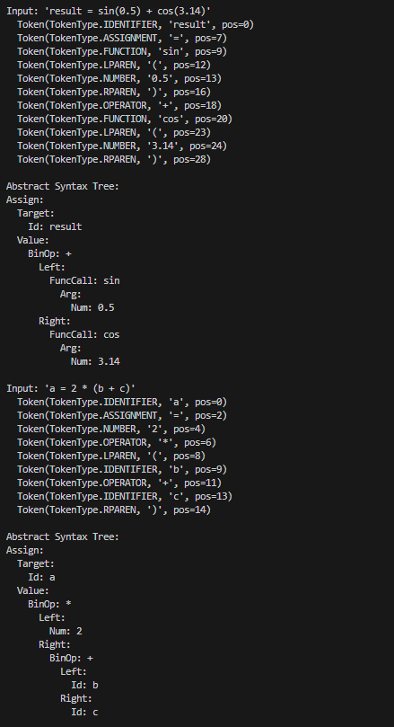

# Report Laboratory Work 6

## MINISTERUL EDUCAȚIEI, CULTURII ȘI CERCETĂRII
### AL REPUBLICII MOLDOVA
#### Universitatea Tehnică a Moldovei  
**Facultatea Calculatoare, Informatică și Microelectronică**  
**Departamentul Inginerie Software și Automatică**  

### **ALEXANDRA BUJOR-COBILI, FAF-232**  
#### **Report - Laboratory work n.6**  
#### **Parser & Building an Abstract Syntax Tree**  

**Checked by:**  
*Cretu Dumitru, university assistant*  
*FCIM, UTM*  

**Chișinău – 2025**  

---

## **1. Theory**
#### **1.1. Parser**
A parser changes input code (shown as tokens) into a tree structure called an Abstract Syntax Tree (AST). The parser checks if the code follows the language rules and makes a tree that shows the code's structure.

#### **1.2. Key Concepts**
Abstract Syntax Tree (AST): A tree that shows the structure of code. Each part of the tree represents a part of the code.
Recursive Descent Parsing: A method where the parser uses functions that call each other. Each function handles one rule of the language.
Grammar Rules: Rules that say what is correct in a programming language. For example, assignment → expr [= expr] is a rule.
Operator Precedence: The order in which operations happen. For example, multiplication happens before addition.

The paarser can change tokens into an AST, check if math expressions and assignments are correct, handle operations in the right order, show function calls and expressions in parentheses.
#### **1.3. Example**
Input: sin(cos(x))
This parses into the following Abstract Syntax Tree:
```
FuncCall: sin
  Arg:
    FuncCall: cos
      Arg:
        Id: x
```
This tree shows that sin is a function call with one argument. That argument is itself another function call, cos, which has the identifier x as its argument. The parser correctly handles nested function calls, preserving their relationship in the tree structure.

---

## **2. Objectives**

1. Get familiar with parsing, what it is and how it can be programmed [1].
2. Get familiar with the concept of AST [2].
3. In addition to what has been done in the 3rd lab work do the following:
   1. In case you didn't have a type that denotes the possible types of tokens you need to:
      1. Have a type __*TokenType*__ (like an enum) that can be used in the lexical analysis to categorize the tokens. 
      2. Please use regular expressions to identify the type of the token.
   2. Implement the necessary data structures for an AST that could be used for the text you have processed in the 3rd lab work.
   3. Implement a simple parser program that could extract the syntactic information from the input text.

---

## **3. Implementation**

### **Code explanation**  
#### **3.1. AST Node Classes**
```python
class ASTNode:
    pass

class NumNode(ASTNode):
    def __init__(self, val):
        self.val = val
    
    def __str__(self):
        return f"Num({self.val})"
```

This code creates the base ASTNode class and the NumNode class for numbers. Each node type comes from the base class and has its own setup. This creates a system where different kinds of expressions can be handled in the language.

```python
class BinOpNode(ASTNode):
    def __init__(self, left, op, right):
        self.left = left
        self.op = op
        self.right = right
    
    def __str__(self):
        return f"BinOp({self.op}, {self.left}, {self.right})"
```

The BinOpNode shows operations like addition and multiplication. It stores the operation symbol and what's on the left and right sides. This makes a tree that can show complex expressions with many parts.

#### **3.2.  Token Consumption**
```python
def eat(self, tok_type):
    if self.curr_tok and self.curr_tok.type == tok_type:
        tok = self.curr_tok
        self.pos += 1
        self.curr_tok = self.tokens[self.pos] if self.pos < len(self.tokens) else None
        return tok
    else:
        return self.error(f"Expected {tok_type}, got {self.curr_tok.type if self.curr_tok else 'None'}")
```

The eat method takes a token of the expected type, moves forward, and returns the token. If the current token is wrong, it reports an error. This method is very important because it checks tokens and moves through them, making sure the code is correct.

#### **3.3. Recursive Descent**
```python
def expr(self):
    # expr -> term [(+|-) term]*
    node = self.term()
    
    if not node:
        return None
    
    while (self.curr_tok and 
           self.curr_tok.type == TokenType.OPERATOR and 
           self.curr_tok.value in ('+', '-')):
        
        op_tok = self.eat(TokenType.OPERATOR)
        if not op_tok:
            return None
            
        right = self.term()
        if not right:
            return None
            
        node = BinOpNode(node, op_tok.value, right)
    
    return node
```

The expr method handles addition and subtraction. It first gets a term and then processes any + or - operators that follow. This shows how each grammar rule becomes a method that can call other rule methods.

```python
def term(self):
    # term -> factor [(*|/) factor]*
    node = self.factor()
    
    if not node:
        return None
    
    while (self.curr_tok and 
           self.curr_tok.type == TokenType.OPERATOR and 
           self.curr_tok.value in ('*', '/')):
        
        op_tok = self.eat(TokenType.OPERATOR)
        if not op_tok:
            return None
            
        right = self.factor()
        if not right:
            return None
            
        node = BinOpNode(node, op_tok.value, right)
    
    return node
```

The term method handles multiplication and division, similar to expr. By having term and expr as separate methods that call each other in a specific order, the parser makes sure multiplication/division happens before addition/subtraction. Same goes for factor method.

#### **3.4. Assignment Handling**
```python
def assignment(self):
    # assignment -> expr [= expr]
    expr = self.expr()
    
    if not expr:
        return None
    
    if self.curr_tok and self.curr_tok.type == TokenType.ASSIGNMENT:
        token = self.eat(TokenType.ASSIGNMENT)
        if not token:
            return None
            
        right = self.expr()
        if not right:
            return None
            
        if isinstance(expr, IdNode):
            return AssignNode(expr, right)
        else:
            return self.error("Left side of assignment must be identifier")
    
    return expr
```

The assignment method handles assignments of values to variables. It first gets an expression and then checks if there's an = sign. If so, it makes sure the left side is a variable name and creates an AssignNode. This allows both simple expressions and assignments to work.

---

## **4. Conclusions**

The parser works well for simple expressions but has clear limitations. As seen in the image, it can correctly parse function calls like sin(cos(x)), basic math expressions like 3.14 + 2, and variable assignments like var_name = 123.
  
However, the error handling needs improvement. The results show several failures: when parsing a++b, the parser gives an "Unexpected token" error but doesn't explain clearly what went wrong.
  
Similarly, with sin(), it fails because it expects something inside the parentheses but doesn't guide the user well. The error message for 5 = x correctly states "Left side of assignment must be identifier" but doesn't suggest a fix.

The parser also fails completely with empty input, showing just "Construction failed" without details. These examples show that the parser could provide better error messages that tell users exactly what's wrong and how to fix it. Adding line and position information to errors would also help users find and correct problems faster.

---

## **5. Bibliography**
1. [Parsing Wiki](https://en.wikipedia.org/wiki/Parsing)
2. [Abstract Syntax Tree Wiki](https://en.wikipedia.org/wiki/Abstract_syntax_tree)
3. [Abstract Syntax Tree (GeeksforGeeks)](https://www.geeksforgeeks.org/abstract-syntax-tree-vs-parse-tree/)
4. [Understand Abstract Syntax Trees (YouTube)](www.youtube.com/watch?v=tM_S-pa4xDk&pp=ygUMI2FzdHNvZnR3YXJl)